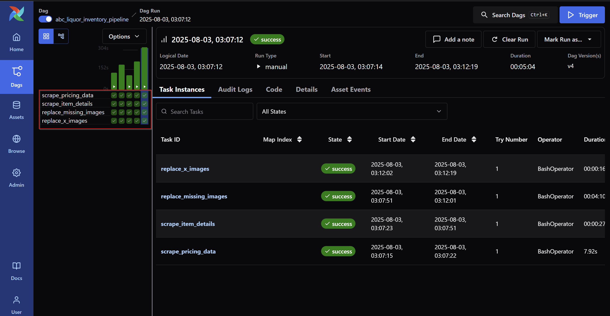

# NC ABC Spirits Inventory Pipeline

## Project Overview

The NC ABC Spirits Inventory project is an automated data pipeline designed to collect, process, and maintain comprehensive spirits inventory data from the North Carolina Alcoholic Beverage Control (ABC) system. This project addresses the challenge of accessing and analyzing spirits inventory data that is publicly available but not easily accessible in a unified, structured format for business intelligence and reporting purposes.

### Business Context

North Carolina operates a state-controlled alcohol distribution system where the ABC Commission manages the sale and distribution of spirits. The ABC website provides quarterly pricing lists and detailed spirit information. This project bridges that gap by:

- **Automating Data Collection**: Scraping the NC ABC website to extract pricing and spirit information
- **Data Enrichment**: Adding spirit images and detailed specifications
- **Structured Storage**: Converting raw HTML data into structured datasets suitable for analysis
- **Power BI Integration**: Providing clean, reliable data for business intelligence reporting

### Data Sources

The pipeline extracts data from the NC ABC website:
- **[Quarterly Pricing Lists](https://abc2.nc.gov/Pricing/PriceList)**: Comprehensive pricing data for all spirits in the NC ABC Board database

### Key Benefits

This automated pipeline provides several advantages for spirits inventory analysis:

1. **Comprehensive Coverage**: Captures all available spirits in the NC ABC system
2. **Rich Metadata**: Includes pricing, specifications, images, and supplier information
3. **Analytics Ready**: Structured data format optimized for Power BI reporting
4. **Scalable Architecture**: Cloud-based processing with automated error handling using Apache Airflow

### Use Cases

The enriched dataset supports various business intelligence use cases:
- **Pricing Analysis**: Price trends and comparisons
- **Product Research**: Detailed specifications and supplier information
- **Visual Reporting**: Product images for enhanced dashboard presentations

## Pipeline Overview using Apache Airflow

The pipeline consists of four main scripts that work together to collect, process, and enrich spirits inventory data:

1. **scrape_pricing_site.py** - Initial data extraction from ABC quarterly pricing list
2. **scrape_item_details.py** - Detailed spirit information extraction
3. **replace_missing_urls.py** - Image URL enrichment using Google Custom Search API for spirits that don't have image URLs on the NC ABC website
4. **replace_x_image_urls.py** - Replaces the invalid "x-image" prefixed image URLs with images from the Google Custom Search API

## Script Details

### 1. scrape_pricing_site.py
**Purpose**: Extracts the quarterly pricing list from the NC ABC website and creates the foundational dataset.

**Key Functions**:
- `create_list_from_abc_request()`: Scrapes the ABC Quarterly Pricing List URL and returns a list of div tags that contain spirit information
- `convert_abc_list_to_df()`: Converts scraped HTML data into a structured pandas DataFrame
- `df_to_gcloud_bigquery()`: Uploads the DataFrame to Google Cloud BigQuery

**Data Extracted**:

| Field | Description |
|-------|-------------|
| NC Code | North Carolina ABC spirit identifier |
| Supplier | Distiller |
| Brand Name | Spirit brand and name |
| Age | Age (if applicable) |
| Proof | Alcohol proof |
| Size | Bottle size (mL/L) |
| Retail Price | Consumer retail price |
| MXB Price | Mixed beverage price |
| Product Category | Spirit classification (e.g., Bourbon, Vodka) |
| Item Details URL | Link to detailed spirit page |

**Output**: Initial pricing data stored in BigQuery for the next pipeline stage.

### 2. scrape_item_details.py
**Purpose**: Asynchronously scrapes detailed spirit information from individual item pages using URLs collected in the first stage.

**Key Functions**:
- `scrape_item_details()`: Asynchronously scrapes individual spirit detail pages
- `process_urls()`: Processes multiple URLs concurrently for efficiency
- `bigquery_to_df()`: Converts BigQuery query to pandas DataFrame

**Data Extracted**:
| Field | Description |
|-------|-------------|
| Brand Name | Spirit brand and name |
| Effective Date | Date the information for the spirit became effective |
| Bottle Size | Bottle size (mL/L) |
| Proof | Alcohol proof |
| Bottles per Case | Number of bottles per case |
| UPC | Universal Product Code |
| Retail Price | Consumer retail price |
| MXB Price | Mixed beverage price |
| Case Cost Less Bailment | Wholesale case cost excluding bailment fees (taxes and handling charges) |
| Distiller | Spirit manufacturer or distributor |
| Product Image URL | Link to spirit image |

**Output**: Enriched product details with comprehensive specifications and pricing information.

### 3. replace_missing_urls.py
**Purpose**: Enriches the dataset by finding product images for items that don't have image URLs using Google Custom Search API.

**Key Functions**:
- `google_custom_image_search()`: Uses Google Custom Search API to find product images
- `process_urls()`: Processes multiple search queries concurrently
- `df_to_gcloud_storage_bucket()`: Uploads enriched data to Google Cloud Storage

**Process**:
- Identifies products missing image URLs
- Constructs search queries using brand name and size
- Uses Google Custom Search API to find relevant product images
- Updates the dataset with found image URLs

**Output**: Dataset with enhanced image coverage for better Power BI visualization.

### 4. replace_x_image_urls.py
**Purpose**: Replaces the invalid "x-image" prefixed image URLs with images from the Google Custom Search API

**Key Functions**:
- `scrape_item_details()`: Scrapes product detail pages to extract image URLs
- `process_urls()`: Processes multiple URLs concurrently
- `replace_x_raw_image_urls()`: Main function that orchestrates the image URL replacement process

**Process**:
- Identifies products still missing image URLs
- Scrapes individual product pages from ABC website
- Extracts product image URLs directly from the source
- Updates the dataset with official product images

**Output**: Final dataset with complete product image coverage for Power BI visualization.

## Apache Airflow Pipeline Flow

```
1. scrape_pricing_data (scrape_pricing_site.py)
   ↓ (Extracts pricing list and item URLs)
2. scrape_item_details (scrape_item_details.py)
   ↓ (Enriches with detailed product information)
3. replace_missing_images (replace_missing_urls.py)
   ↓ (Adds images via Google Custom Search API)
4. replace_x_images (replace_x_image_urls.py)
   ↓ (Final image cleanup using Google Custom Search API)
   → Refreshes the Power BI Report
```


## DAG Orchestration

The pipeline is orchestrated using Apache Airflow through the DAG file located at `{$HOME}/airflow/dags/abc_liquor_inventory_pipeline_dag.py`.


### DAG Configuration

- **DAG Name**: `abc_liquor_inventory_pipeline`
- **Schedule**: Daily at 6:00 AM (`0 6 * * *`)
- **Owner**: datadevda1
- **Retries**: 3 attempts with 5-second delay between attempts
- **Email Notifications**: Enabled for task failures

### Task Structure

The DAG consists of four sequential tasks that correspond to the pipeline scripts:

1. **scrape_pricing_data**: Executes `scrape_pricing_site.py`
   - Sets Google Cloud credentials
   - Extracts initial pricing data from ABC website

2. **scrape_item_details**: Executes `scrape_item_details.py`
   - Runs after pricing data extraction
   - Enriches dataset with detailed product information

3. **replace_missing_images**: Executes `replace_missing_urls.py`
   - Runs after item details extraction
   - Uses Google Custom Search API for image enrichment
   - Requires Google API Key and Search Engine ID

4. **replace_x_images**: Executes `replace_x_image_urls.py`
   - Final task in the pipeline
   - Extracts remaining images from ABC website
   - Completes the dataset for Power BI consumption



### Task Dependencies

```
scrape_pricing_data >> scrape_item_details >> replace_missing_images >> replace_x_images
```

### Environment Variables

The DAG uses Airflow variables for secure credential management:
- `GOOGLE_APPLICATION_CREDENTIALS`: Google Cloud service account credentials
- `GOOGLE_API_KEY`: Google Custom Search API key
- `GOOGLE_SEARCH_ENGINE_ID`: Google Custom Search Engine ID

### Working Directory

All scripts are executed from: `/home/datadevda1/airflow/projects/abc_liquor_inventory/scripts`

## Power BI Report

The NC ABC Spirits Inventory Power BI report provides comprehensive analysis and visualization of the collected spirits data through three main pages:

### 1. Spirit Summary
A high-level dashboard providing key metrics and overview statistics of the NC ABC spirits inventory, including total products, prices, and categories.

### 2. Detail Report
A comprehensive data table view allowing users to explore individual spirit records with all available fields including pricing, specifications, and product images.

### 3. Spirit Comparison
An interactive comparison tool enabling side-by-side analysis of different spirits based on pricing, proof, age, and other characteristics.